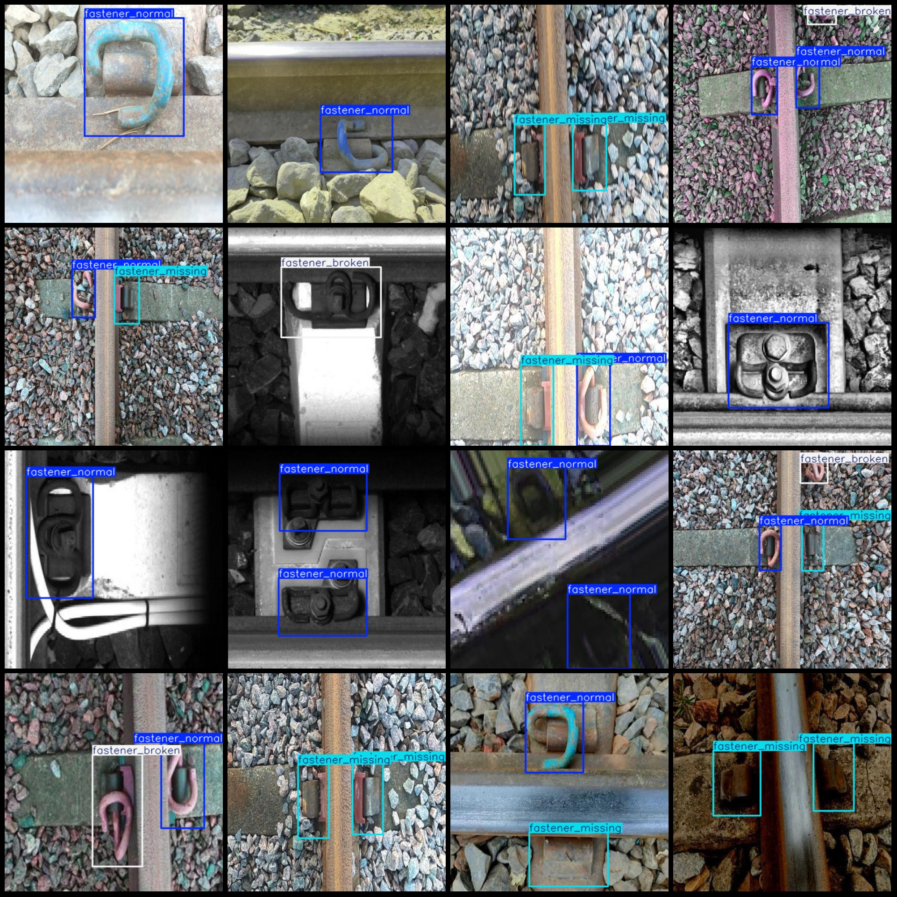
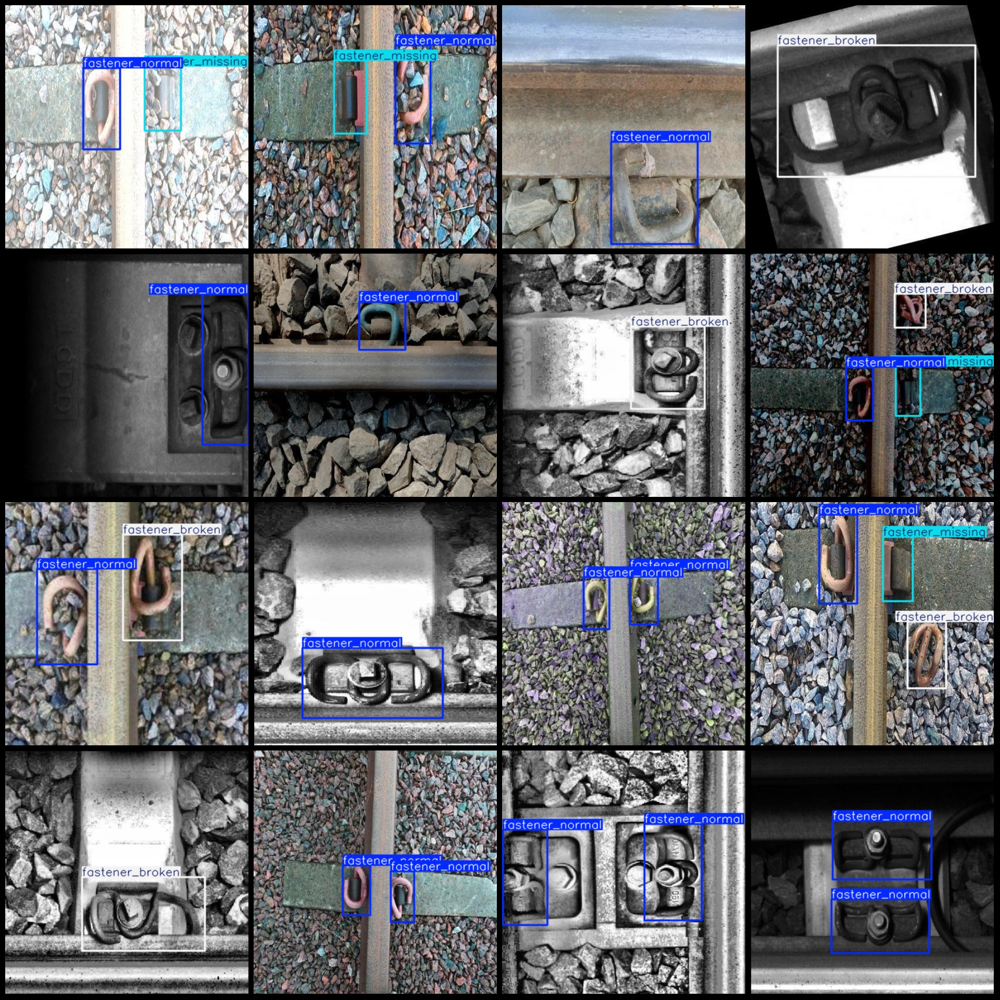

# Smart Railway Track Fasteners Missing or Broken Detection Dataset in VOC+YOLO Format (1266 Images, 3 Categories)

Please note that some images in the dataset are enhanced with rotation.

The dataset is formatted as Pascal VOC + YOLO (excluding the split path in the txt file, only containing JPG images along with their corresponding VOC format XML files and YOLO format TXT files).

Number of images (JPG file count): 1266
Number of annotations (XML file count): 1266
Number of annotations (TXT file count): 1266
Number of categories: 3
Category names according to the labels folder's classes.txt: ["fastener_broken", "fastener_missing", "fastener_normal"]
Box counts for each category:
- fastener_broken (fastener damage): 329 boxes
- fastener_missing (fastener missing): 518 boxes
- fastener_normal (fastener normal): 1291 boxes
Total box count: 2138
Image counts for each category:
- fastener_broken (fastener damage): 315 images
- fastener_missing (fastener missing): 399 images
- fastener_normal (fastener normal): 899 images
Image resolution: 416x416
Annotation tool used: labelImg
Annotation rules applied: draw rectangle boxes for each category
Important Notice: The dataset does not have a separate training/validation/test set; it needs to be divided by the user.
Special Disclaimer: This dataset does not guarantee any accuracy in the training models or weight files.

**Example of Annotation:**

Image

Here is a pay link on Stripe ( https://buy.stripe.com/3cs8yP7sY87d0vu9AB ). Please contact me lonlonago@foxmail.com after funding $89, and I will send you a complete data files , thank you!

